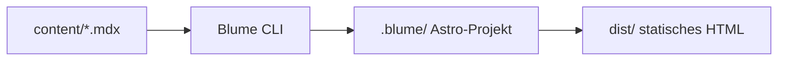

Jede Seite ist eine `.md`- oder `.mdx`-Datei mit einem Frontmatter-Block. MDX-Seiten können zusätzlich Direktiven (Callouts, Diagramme) und [Komponenten](/guides/komponenten) verwenden.

## Frontmatter

```mdx lineNumbers
---
title: Inhalte schreiben
description: Wird für Suche, SEO und Open-Graph verwendet.
sidebar:
  label: Kurzer Sidebar-Name
  icon: pencil
  order: 1
---
```

`title` ist Pflicht, alles andere optional. `sidebar.order` steuert die Position innerhalb der Gruppe.

## Callouts

Callouts heben Kontext, Tipps oder Risiken hervor. Syntax: `:::typ`, optional mit Titel in eckigen Klammern.

:::note
Neutrale Zusatzinfo, die der Leser im Hinterkopf behalten sollte.
:::

:::tip
Ein hilfreicher Shortcut oder Best Practice.
:::

:::warning[Achtung]
Etwas, das ohne Vorsicht zu Überraschungen führt.
:::

:::success
Bestätigung, dass ein Schritt geklappt hat.
:::

```md
:::warning[Achtung]
Etwas, das ohne Vorsicht zu Überraschungen führt.
:::
```

## Code-Blöcke

Code-Fences unterstützen Syntax-Highlighting, Dateinamen im Titel und Zeilennummern:

```ts blume.config.ts lineNumbers
import { defineConfig } from "blume";

export default defineConfig({
  title: "Blume Playground",
  description: "Documentation powered by Blume.",
});
```

Ein `package-install`-Block wird automatisch zu Tabs für npm, pnpm, yarn und bun:

```package-install
npm i blume
```

## Tabellen

Normale Markdown-Tabellen funktionieren überall:

| Feature | Datei | Zero-Config |
| --- | --- | --- |
| Navigation | Ordnerstruktur | ✅ |
| Suche | — | ✅ |
| Theming | `blume.config.ts` | optional |

## Diagramme

Mermaid-Diagramme direkt als Code-Fence (MDX-only):



## Weiter geht's

<CardGroup cols={2}>
  <Card title="Komponenten" href="/guides/komponenten" icon="folder">
    Die eingebaute Komponenten-Bibliothek im Überblick.
  </Card>
  <Card title="Navigation" href="/guides/navigation" icon="menu">
    Sidebar-Gruppen und Reihenfolge steuern.
  </Card>
</CardGroup>
